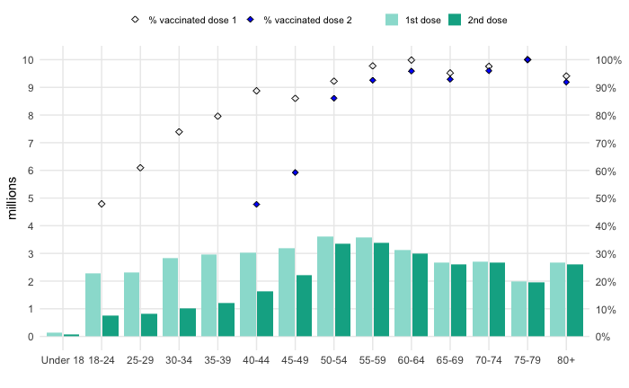
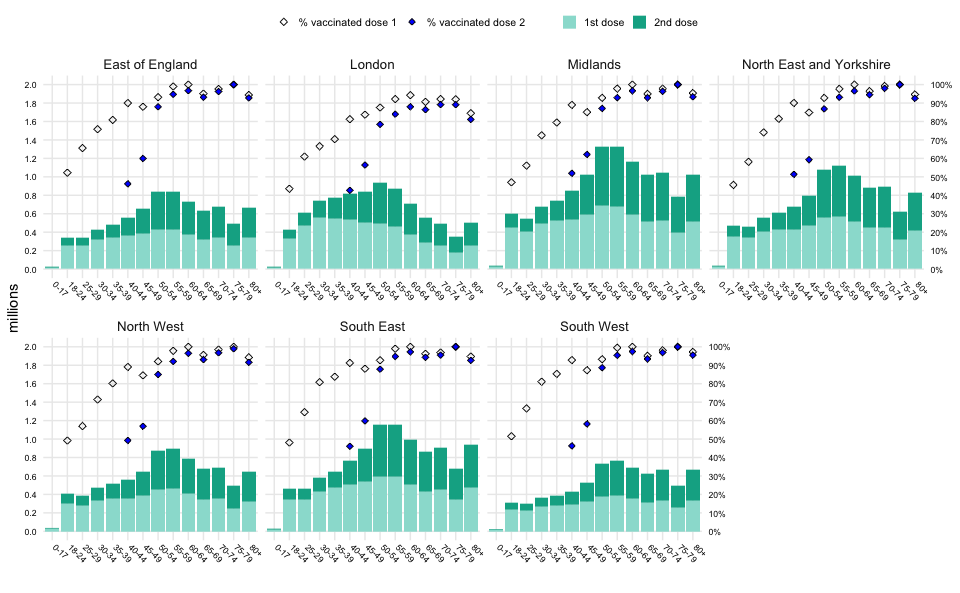
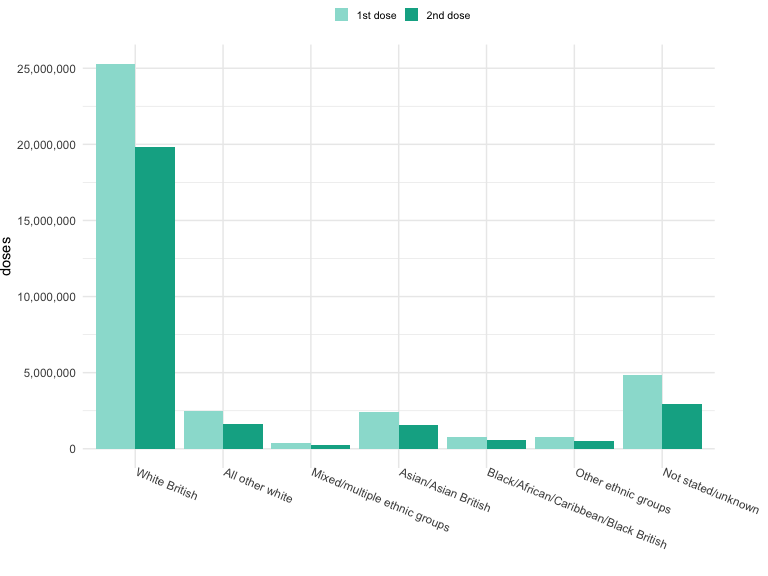

# nhs-vaccine-stats-rap

## Getting started

To use and develop this code, you should have some familiarity with R, RStudio, and the tidyverse set of packages. 

If any of these are not familiar then you may want to look at chapter 1 'Introduction' of *R for Data Science* by Hadley Wickham, which can be accessed for free at the link below.

https://r4ds.had.co.nz/introduction.html

Chapter 27 'R Markdown' might also be useful for working with Rmd files.

### Usage

Use RStudio to run the various Rmd files. 

For example, to run all cells, you can use the Run All command.

Make sure to open the project in RStudio using the provided Rproj file, this ensures that the working directory is set correctly.

### Getting the data

You can download the latest data from:

https://www.england.nhs.uk/statistics/statistical-work-areas/covid-19-vaccinations/

### Creating charts

For each chart of interest, there will be an associated Rmd file, e.g. `01_vaccine_coverage.Rmd`. You can run this file in RStudio to create the desired chart output.

### Updating the code

Occasionally the Excel files published on the NHS Statistics website will change schema. This could include changes to: the sheet names, the column names, the location of tables, etc. Whenever this happens you will need to update variables in the code so that the table is read correctly. For most cases, the tests in each file (i.e. the `stopifnot()` statements) should flag up that something is not quite right if the data is not in the expected format.

### Updating the charts

Each chart is made in ggplot2. A useful cheatsheet for working with ggplot2 and its 'grammar of graphics' system can be found at the link below.

https://ggplot2.tidyverse.org/

For example, to update the figure size, including width and height, you can use the `fig.width` and `fig.height` variables which are set at the top of the R chunk that contains the ggplot code.

## Example output

Below is some example output for the data as of 1 July 2021.

### 1. Vaccine coverage in England

### 2. Vaccine coverage by region and age

### 3. Vaccine coverage by ethnicity

